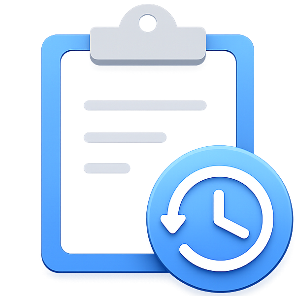
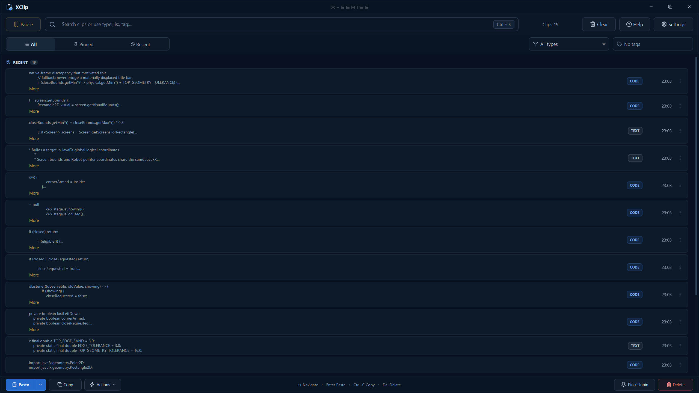
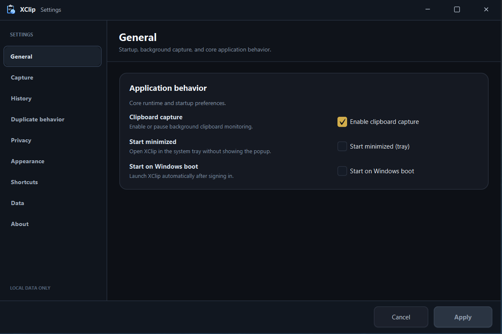

<p align="center">
  
</p>

<h1 align="center">XClip</h1>

<p align="center">
  <strong>A local-first clipboard workspace for Windows.</strong><br>
  Search, pin, tag, paste, and manage persistent clipboard history without sending it to the cloud.
</p>

<p align="center">
  <a href="https://github.com/End1essspace/XClip/releases"></a>
  <a href="LICENSE"></a>
  
</p>

<p align="center"><a href="#english">English</a> · <a href="#русский">Русский</a></p>

---

# English

Current version: **v1.4.0**

<p align="center">
  <a href="https://github.com/End1essspace/XClip/releases"><strong>Download XClip</strong></a>
  · <a href="docs/USER_GUIDE.md">User guide</a>
  · <a href="docs/RELEASE_NOTES_v1.4.0.md">Release notes</a>
</p>

<p align="center">
  
</p>

> **Release preparation:** XClip **v1.4.0** is version-aligned across Gradle, JAR/MSI packaging, and UI contract revision 19. Post-migration `clean test` and `build` passed, `XClip-1.4.0.msi` was built successfully, and the installed packaged application passed the release-owner smoke check. Gate C was accepted from the manual checks already performed throughout the final UI-polish cycle. The optional formal 18-case M8 evidence suite was **waived for v1.4.0** and is not claimed as PASS. Remaining publication steps are the final release commit, fresh artifact checksum, `v1.4.0` tag, and GitHub Release.

## What XClip does

| Area | What it provides |
|---|---|
| **Persistent history** | Local SQLite clipboard history with bounded loading and previews. |
| **Direct Paste** | Restore the previously active target and send standard `Ctrl+V`, with Copy fallback. |
| **PINNED** | Keep important clips, assign titles, and maintain a manual order. |
| **Tags** | Create, assign, filter, rename, delete, and batch-edit local tags. |
| **Advanced search** | Search content, PINNED titles, and tags with type/scope/tag operators. |
| **Safe actions** | Open HTTP(S), reveal paths, format JSON, or copy code/commands without executing clipboard commands. |
| **Privacy & retention** | App exclusions, optional sensitive-content suppression, age/type cleanup, and clear-on-exit policy. |
| **Data recovery** | Integrity check, WAL checkpoint, optimize, versioned backup, and validated restore. |

## Clipboard workflow

```text
Copy text anywhere in Windows
        ↓
XClip stores it locally
        ↓
Ctrl+Shift+V
        ↓
Search / filter / pin / tag / select
        ↓
Paste, Copy, or a safe type-aware action
```

The popup supports `All`, `Pinned`, and `Recent` scopes, content-type filters, tag filters, multi-selection, keyboard navigation, bounded previews, and contextual actions.

## Search

Supported operators include:

```text
type:url
type:code
type:path
type:json
type:command
type:text
is:pinned
is:recent
tag:work
tag:"Project Work"
-tag:private
-type:text
```

Search assistance is contextual and non-blocking: operator chips, suggestions, and diagnostics appear only when useful and do not permanently increase the header height.

## v1.4.0 development highlights

- Persistent SQLite WAL history with configurable duplicate handling.
- Direct Paste with foreground-target restoration and Copy fallback.
- PINNED ordering, optional titles, tags, and batch actions.
- TEXT, CODE, URL, PATH, JSON, and COMMAND classification.
- Advanced search with positive and negative type/tag operators.
- Nine-page Settings architecture with Apply/Cancel, validation, and responsive layout.
- Local privacy exclusions and optional payment-card-like / contextual OTP suppression.
- General and per-type RECENT retention, scheduled cleanup, and clear-on-exit.
- Database integrity, checkpoint, optimize, backup, and rollback-protected restore.
- Responsive popup with bounded previews, virtualization, keyboard-first navigation, and accessible names.
- Calm dark UI, larger readable action menus, and a subtle centered `X-SERIES` title-bar wordmark.
- Windows Fitts-law hardening: the maximized top-right close corner remains usable at the physical screen edge.
- Fitts-law scrollbar ergonomics: a wider interaction lane while the visible scrollbar stays slim, plus maximized right-edge thumb dragging.
- Multi-monitor, DPI/topology recovery, tray/hotkey recovery, and ordered shutdown hardening.

## Safety and privacy guarantees

- Clipboard commands are **never executed automatically**.
- Copied executable or script paths are not launched as commands.
- Sensitive-content detection is local-only and opt-in for suppression.
- Existing history is not silently rescanned or deleted when privacy rules change.
- PINNED clips are excluded from ordinary retention cleanup.
- Full clipboard contents are not exposed through automatic hover tooltips.
- No telemetry or cloud synchronization is part of the documented product contract.

## Windows integration

- Windows 10/11 x64.
- Java 17 + JavaFX 21 desktop application.
- System tray and close-to-background behavior.
- Global `Ctrl+Shift+V` popup shortcut.
- Single-instance activation.
- Optional per-user Start with Windows.
- Explorer tray/hotkey recovery.
- Sleep/resume, lock/unlock, display topology, and DPI recovery.
- Per-user MSI packaging with a bundled runtime; no separate Java installation is required for the packaged application.

Local user data:

```text
%USERPROFILE%\.xclip\
```

| Purpose | File |
|---|---|
| Clipboard database | `xclip.db` |
| Configuration | `config.json` |
| SQLite sidecars | `xclip.db-wal`, `xclip.db-shm`, or `xclip.db-journal` when present |

## Settings and recovery

<p align="center">
  
</p>

Settings pages:

```text
General
Capture
History
Duplicate behavior
Privacy
Appearance
Shortcuts
Data
About
```

Settings → Data contains database status, integrity checking, WAL checkpoint, optimize, retention cleanup, destructive clear operations, backup, and validated restore.

## Build from source

```powershell
git clone https://github.com/End1essspace/XClip.git
cd XClip
.\gradlew.bat clean test --no-daemon
.\gradlew.bat build --no-daemon
```

Build the Windows MSI:

```powershell
.\gradlew.bat clean packageMsi --no-daemon
```

The packaged build uses `jpackage` plus a bundled runtime image.

## Documentation

| Document | Purpose |
|---|---|
| [User guide](docs/USER_GUIDE.md) | Complete user-facing behavior and troubleshooting |
| [Russian user guide](docs/USER_GUIDE_RU.md) | Russian user-facing guide |
| [Roadmap](docs/roadmap.md) | Current v1.4.0 implementation status and release path |
| [UI contract](docs/UI_CONTRACT.md) | Current human-readable UI/product contract |
| [Validation](docs/VALIDATION.md) | Current regression, manual, packaged, and release gates |
| [Database & backup](docs/M7_DATABASE_MAINTENANCE.md) | SQLite maintenance, backup, restore, and rollback contract |
| [Windows lifecycle](docs/M8_WINDOWS_LIFECYCLE.md) | Packaged lifecycle hardening and required evidence |
| [Draft release notes](docs/RELEASE_NOTES_v1.4.0.md) | Current v1.4.0 release summary |

> Milestone-named M6/M7/M8/R10/R11 documents, CSV matrices, and
> `UI_CONTRACT_v1.3.0.md` remain in `docs/` as frozen build/release-gate assets.
> They are intentionally not renamed until the corresponding Gradle/script
> contracts are migrated.

### README image paths

The README references the packaged application icon and repository screenshots:

```text
app/src/main/resources/icons/icon.png
docs/screenshots/xclip-popup.png
docs/screenshots/xclip-settings.png
```

The screenshots are documentation assets only. The icon is also used by the XClip runtime.

## Author

**End1essspace | RX**  
Telegram: [@End1essspace](https://t.me/End1essspace)  
GitHub: [End1essspace](https://github.com/End1essspace)

## License

XClip is licensed under the [GNU General Public License v3.0](LICENSE).

Selected Lucide SVG icons are distributed under the ISC License. See [THIRD_PARTY_NOTICES.md](THIRD_PARTY_NOTICES.md).

Copyright (C) 2026 Rafael Xudoynazarov (End1essspace | RX)

---

# Русский

Текущая версия: **v1.4.0**

<p align="center">
  <a href="https://github.com/End1essspace/XClip/releases"><strong>Скачать XClip</strong></a>
  · <a href="docs/USER_GUIDE_RU.md">Руководство</a>
  · <a href="docs/RELEASE_NOTES_v1.4.0.md">Описание релиза</a>
</p>

**XClip** — local-first менеджер буфера обмена для Windows: persistent history, Direct Paste, PINNED, теги, advanced search, privacy/retention и инструменты восстановления данных.

> **Подготовка релиза:** XClip **v1.4.0** синхронизирован по Gradle, JAR/MSI packaging и UI contract revision 19. Post-migration `clean test` и `build` прошли, `XClip-1.4.0.msi` успешно собран, а установленная packaged-версия прошла smoke check. Gate C принят по ручным проверкам, уже выполненным по ходу финального UI-polish. Формальный M8-набор из 18 кейсов **waived для v1.4.0** и не заявляется как PASS. До публикации остаются final release commit, свежий checksum артефакта, tag `v1.4.0` и GitHub Release.

## Основные возможности

- локальная SQLite WAL history;
- `Ctrl+Shift+V` для быстрого открытия popup;
- Direct Paste и Copy fallback;
- PINNED-записи с ручным порядком и titles;
- теги и batch editing;
- фильтры All/Pinned/Recent, типов и тегов;
- advanced search с `type:`, `is:`, `tag:` и negative operators;
- safe actions для URL/PATH/JSON/CODE/COMMAND без выполнения команд;
- privacy exclusions и optional sensitive-content suppression;
- retention по возрасту и типу;
- integrity/checkpoint/optimize/backup/restore;
- responsive keyboard-first popup и девятистраничные Settings;
- восстановление tray/hotkey и Windows lifecycle state.

## UI и эргономика

- спокойная dark navy/graphite palette;
- ненавязчивый `X-SERIES` wordmark по центру title bar;
- увеличенные и более читаемые action menu items и Lucide icons;
- search assist отображается как contextual overlay и не раздвигает header постоянно;
- в maximized-окне физический правый верхний угол остаётся полноценной Close-target;
- scrollbar визуально остаётся тонким, но имеет увеличенную interactive lane;
- thumb можно захватывать с физического правого края maximized-экрана.

## Безопасность и приватность

- XClip не выполняет clipboard commands;
- executable/script paths не запускаются как команды;
- sensitive detection выполняется локально;
- privacy rules не удаляют старую history автоматически;
- PINNED не участвуют в обычном retention cleanup;
- telemetry/cloud sync не входят в documented product contract.

## Локальные данные

```text
%USERPROFILE%\.xclip\
```

## Сборка

```powershell
git clone https://github.com/End1essspace/XClip.git
cd XClip
.\gradlew.bat clean test --no-daemon
.\gradlew.bat build --no-daemon
```

MSI:

```powershell
.\gradlew.bat clean packageMsi --no-daemon
```

## Документация

- [Руководство пользователя](docs/USER_GUIDE_RU.md)
- [User Guide](docs/USER_GUIDE.md)
- [Roadmap](docs/roadmap.md)
- [UI contract](docs/UI_CONTRACT.md)
- [Validation / release gate](docs/VALIDATION.md)
- [Database & backup](docs/M7_DATABASE_MAINTENANCE.md)
- [Windows lifecycle](docs/M8_WINDOWS_LIFECYCLE.md)
- [Draft release notes v1.4.0](docs/RELEASE_NOTES_v1.4.0.md)

Технические M6/M7/M8/R10/R11 документы, CSV-матрицы и
`UI_CONTRACT_v1.3.0.md` остаются отдельными frozen build/release-gate assets,
пока соответствующие Gradle/script contracts не будут мигрированы.

## Автор и лицензия

**End1essspace | RX** · [@End1essspace](https://t.me/End1essspace) · [GitHub](https://github.com/End1essspace)

XClip распространяется по лицензии [GNU GPL v3.0](LICENSE).
